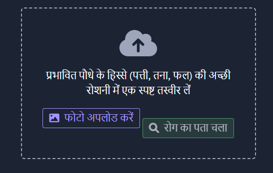

# KrishiSahayak - Plant Disease Detection Platform

A comprehensive multilingual plant disease detection platform designed specifically for Indian farmers, leveraging advanced AI technologies to provide accurate disease identification, treatment recommendations, and community-driven agricultural support.



*Screenshot: Plant disease detection interface in Hindi*

## Features

- **AI-Powered Disease Detection**: Upload plant images to identify diseases with high accuracy
- **Multilingual Support**: Available in 6 Indian languages (English, Hindi, Tamil, Telugu, Bengali, Gujarati)
- **Treatment Recommendations**: Get detailed remedies and preventive measures for detected diseases
- **Farmer Community Forum**: Connect with other farmers to share knowledge and seek advice
- **AI Chatbot Assistant**: Get instant answers to farming and plant health questions

## Technologies Used

- **Backend**: Python, Flask, SQLAlchemy
- **AI/ML**: Google Gemini AI (with OpenAI fallback)
- **Database**: PostgreSQL
- **Frontend**: HTML, CSS, JavaScript, Bootstrap 5
- **Authentication**: Flask-Login

## Setup and Installation

### Local Development

1. Clone the repository
2. Install the following dependencies:
   ```
   email-validator==2.1.0
   flask==3.0.2
   flask-login==0.6.3
   flask-sqlalchemy==3.1.1
   google-generativeai==0.4.0
   gunicorn==23.0.0
   openai==1.14.1
   pillow==10.2.0
   psycopg2-binary==2.9.9
   sqlalchemy==2.0.25
   werkzeug==3.0.1
   ```
3. Configure environment variables in a `.env` file (see `.env.example`)
4. Initialize database
5. Run the application: `python main.py`

### Deployment on Render

1. Fork or clone this repository to your GitHub account
2. Sign up for a [Render](https://render.com/) account
3. In the Render dashboard, click "New" and select "Blueprint"
4. Connect your GitHub repository
5. Render will detect the `render.yaml` configuration
6. Set up the required environment variables in the Render dashboard:
   - `GEMINI_API_KEY` - Your Google Gemini API key
   - `OPENAI_API_KEY` - Your OpenAI API key (optional fallback)
   - `SESSION_SECRET` - A secret key for session management
7. Click "Apply" to deploy the application with a PostgreSQL database
8. Render will automatically build and deploy your application

## Contributing

Contributions are welcome! Please feel free to submit a Pull Request.

## License

This project is licensed under the MIT License - see the LICENSE file for details.